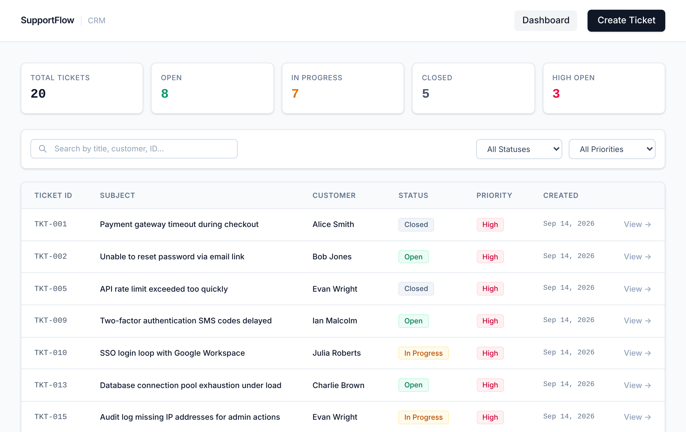
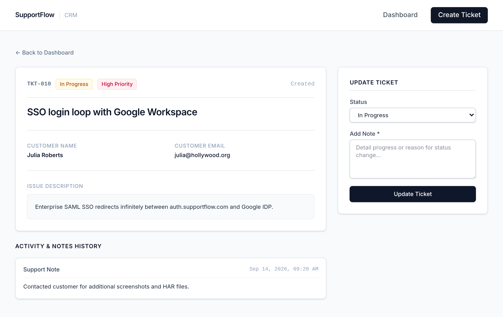
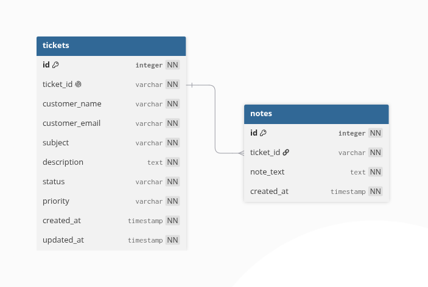
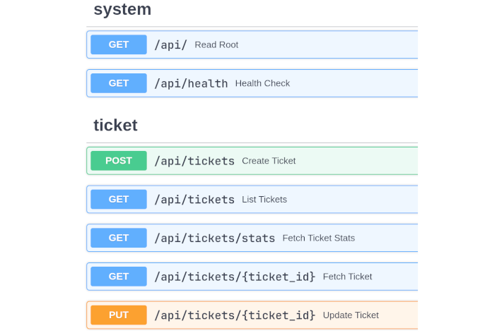

<div align="center">

# SupportFlow - Customer Support CRM

A lightweight, full-stack customer support ticket management system for teams to create, manage, and resolve customer issues efficiently.

</div>

<div align="center">

[Live Application](https://supportflow-crm.up.railway.app/) • [API Docs](https://supportflow-crm.up.railway.app/docs) • [GitHub](https://github.com/viraj-sh/supportflow-crm) • [Docker Hub](https://hub.docker.com/repository/docker/virajsh/supportflow-crm)

</div>

---

## Features

- Create tickets with customer information and issue details
- Auto-generated ticket IDs and timestamps
- Search functionality across names, IDs, emails, and descriptions
- Filter tickets by status (Open, In Progress, Closed)
- View and update ticket details
- Add and manage ticket notes/comments
- Priority levels (High, Medium, Low) for ticket prioritization

## Tech Stack

- **Backend** — Python, FastAPI, SQLAlchemy ORM, Pydantic
- **Frontend** — HTML, CSS, Vanilla JavaScript, Tailwind CSS, Vite
- **Database** — PostgreSQL (production), SQLite (local development)
- **Deployment** — Docker, Railway

## Setup Instructions

**Prerequisites**
- Python 3.10+
- Node.js 16+ and npm

**Clone Repository**
```bash
git clone https://github.com/viraj-sh/supportflow-crm.git
cd supportflow-crm
```

**Frontend Setup**
```bash
cd frontend
npm install
npm run build
```
Frontend builds to `backend/app/static`

**Backend Setup**
```bash
cd backend
python -m venv venv
source venv/bin/activate  # On Windows: venv\Scripts\activate
pip install -e .
uvicorn app.main:app --reload
```

Access the application at `http://localhost:8000`

**Environment Variables**
- Local development uses SQLite by default
- For PostgreSQL: `DATABASE_URL=postgresql+psycopg://[user:[password]@]host[:port]/[database]`

## Preview


| Dashboard | Ticket Details |
|---|---|
|  |  |

| Database Schema | API Endpoints |
|---|---|
|  |  |

## Future Improvements

- User authentication and session management
- Role-based access control (Admin, Support Agent, Customer)
- Automated email notifications
- Unit and integration tests